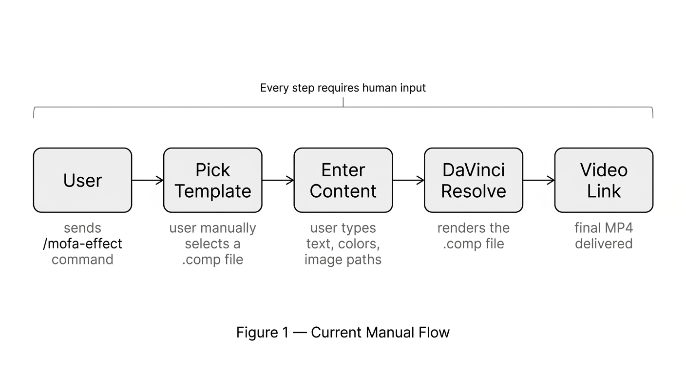
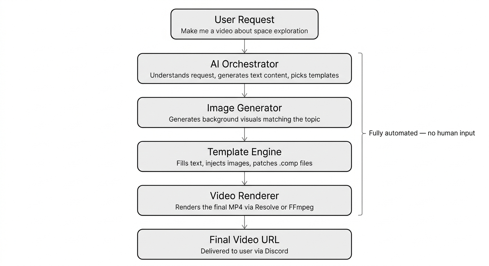
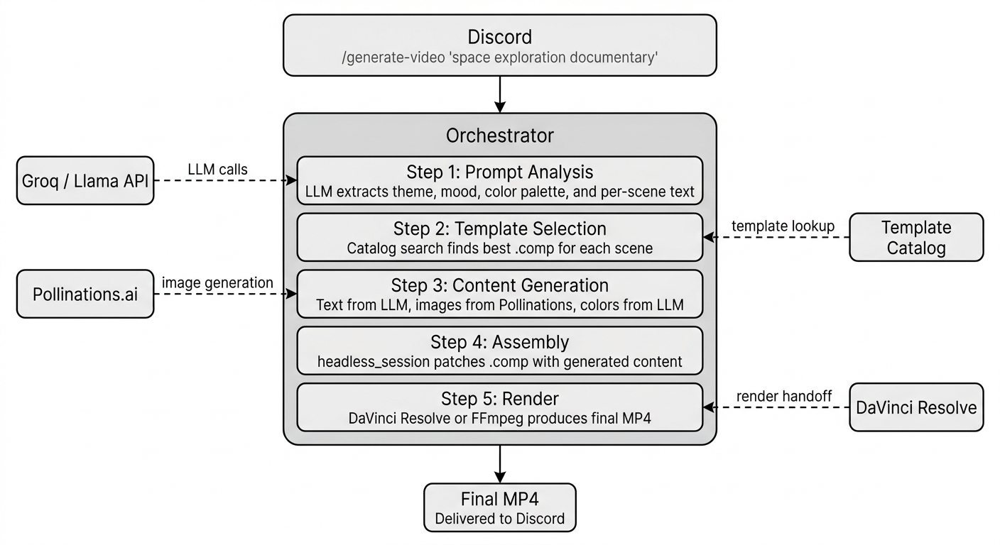
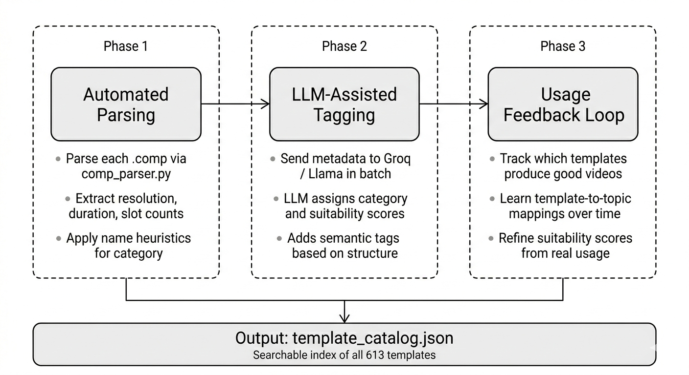
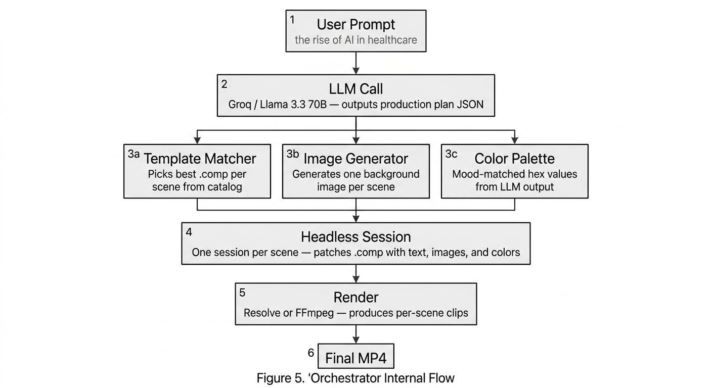
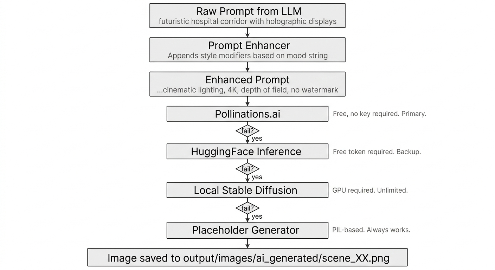
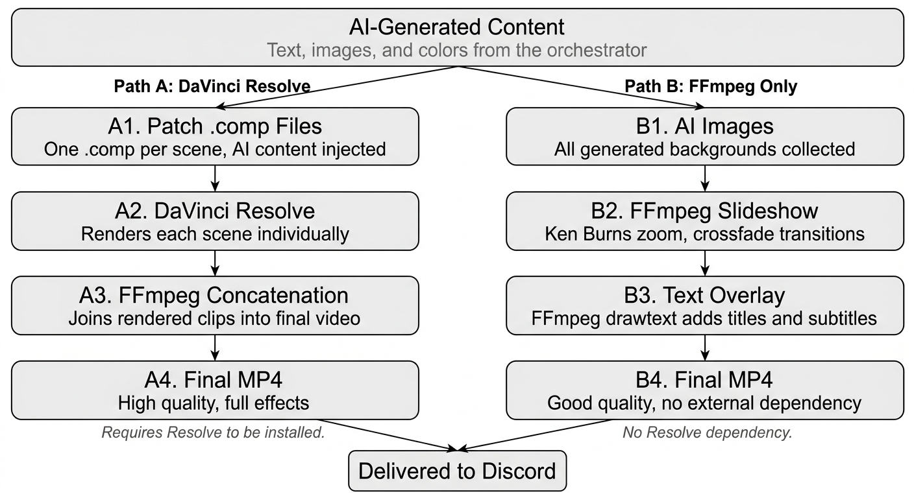
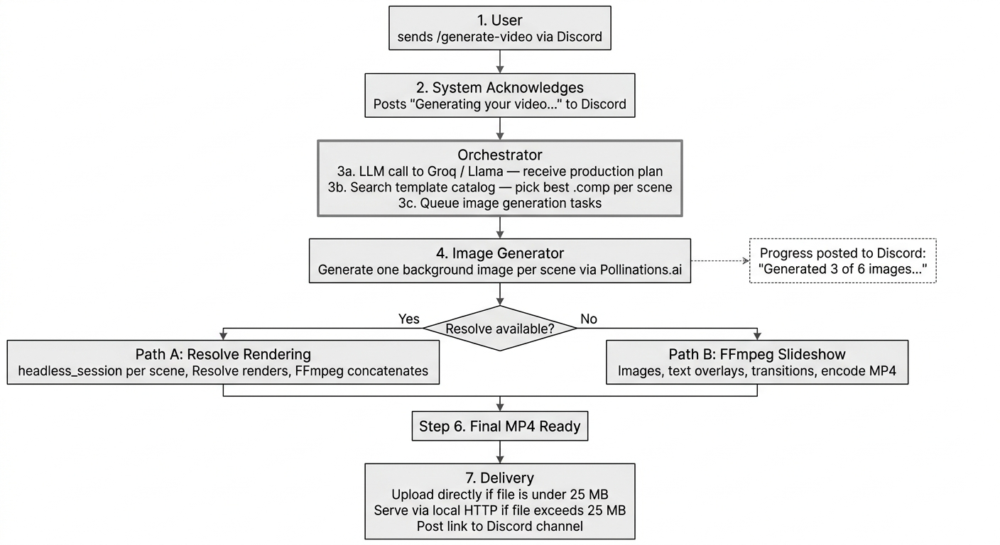

# MoFA Effect — Automatic AI Video Generation System

**Architecture Reference v1.0**

---

## Table of Contents

1. [Existing Infrastructure](#1-existing-infrastructure)
2. [What Needs to Be Built](#2-what-needs-to-be-built)
3. [System Architecture](#3-system-architecture)
4. [Free Tools and Services Strategy](#4-free-tools-and-services-strategy)
5. [Template Catalog System](#5-template-catalog-system)
6. [AI Orchestration Layer](#6-ai-orchestration-layer)
7. [AI Image Generation Pipeline](#7-ai-image-generation-pipeline)
8. [Video Assembly and Rendering](#8-video-assembly-and-rendering)
9. [End-to-End Workflow](#9-end-to-end-workflow)
10. [Implementation Phases](#10-implementation-phases)
11. [File Structure](#11-file-structure)
12. [Risks and Mitigations](#12-risks-and-mitigations)
13. [Future Extensions](#13-future-extensions)

---

## 1. Existing Infrastructure

The following components are already working. Do not rebuild them.

| Component | Location | What It Does |
|-----------|----------|--------------|
| .comp parser | `mofa-effect/comp/comp_parser.py` | Detects text slots, image slots, colors, and fonts inside a .comp file |
| .comp modifier | `mofa-effect/comp/comp_modifier.py` | Patches a .comp file with new text, image paths, and color values |
| Placeholder generator | `mofa-effect/comp/placeholder_generator.py` | Creates placeholder images and videos via PIL and FFmpeg when real content is unavailable |
| Font picker | `mofa-effect/comp/font_picker.py` | Enumerates installed fonts and selects the best match |
| Resolve render handoff | `mofa-effect/comp/resolve_renderer.py` | Installs the render script into Resolve and writes the handoff JSON |
| Render script | `mofa-effect/comp/mofa_render.py` | Executes inside DaVinci Resolve's scripting environment |
| Headless session API | `mofa-effect/comp/headless_session.py` | Runs the full pipeline programmatically without a human at the terminal |
| Discord bot (Rust) | `core/src/channels/discord/mod.rs` | Exposes the /mofa-effect slash command and manages sessions |
| Template library | `mofa-effect/comp/testing_files/` | 613 .comp template files |
| Interactive pipeline | `mofa-effect/comp/main.py` | 6-phase terminal workflow for manual use |

### Current State: The Manual Flow

Every step from template selection to content input currently requires a human operator. The goal is to automate everything between the user's command and the delivered video link.

---

<!-- DIAGRAM: Figure 1 — Current Manual Flow

IMAGE PROMPT (feed this directly into your image generation model):

A clean horizontal flowchart on a plain white background. No shadows, no gradients, no icons, no 3D effects. Flat design only. Sans-serif font throughout. Thin black outlines on all shapes. Light grey fill (#f5f5f5) on all boxes. Black text. Simple single-line arrows with small filled arrowheads.

Five rounded rectangles arranged in a single horizontal row, left to right, connected by arrows pointing right:

Box 1: label "User" — smaller grey text directly below the box: "sends /mofa-effect command"
Box 2: label "Pick Template" — smaller grey text below: "user manually selects a .comp file"
Box 3: label "Enter Content" — smaller grey text below: "user types text, colors, image paths"
Box 4: label "DaVinci Resolve" — smaller grey text below: "renders the .comp file"
Box 5: label "Video Link" — smaller grey text below: "final MP4 delivered"

Above all five boxes, a thin horizontal bracket (an arc or brace shape) spanning the full width of all five boxes, with the label "Every step requires human input" centered above the bracket in small black text.

No decorative elements. No background color. Generous whitespace between boxes.
-->


*Figure 1: The current manual flow. Every step from template selection to content input requires a human operator.*

---

## 2. What Needs to Be Built

Six new components are required. Everything else reuses existing code.

| # | Component | Purpose |
|---|-----------|---------|
| 1 | Template Catalog | Index all 613 .comp files with structured metadata so the system can pick the right template automatically |
| 2 | AI Orchestrator | LLM-powered brain that reads a user prompt and produces a full video production plan |
| 3 | Image Generator | Calls free AI image APIs to produce background visuals matching each scene |
| 4 | Auto-Compositor | Drives headless_session.py using the orchestrator's output instead of human input |
| 5 | Slideshow Builder | Assembles AI-generated images into a video with transitions and text overlays when Resolve is unavailable |
| 6 | Discord /generate-video | New slash command for the fully automated flow, separate from the existing manual /mofa-effect command |

---

<!-- DIAGRAM: Figure 2 — Target Automated Flow

IMAGE PROMPT (feed this directly into your image generation model):

A clean vertical flowchart on a plain white background. No shadows, no gradients, no icons, no 3D effects. Flat design only. Sans-serif font throughout. Thin black outlines on all shapes. Light grey fill (#f5f5f5) on all boxes. Black text. Simple single-line arrows with small filled arrowheads pointing downward.

Six rounded rectangles stacked vertically, connected by downward arrows:

Box 1 (top): label "User Request" — smaller grey text directly below the box: "Make me a video about space exploration"
Box 2: label "AI Orchestrator" — smaller grey text below: "Understands request, generates text content, picks templates"
Box 3: label "Image Generator" — smaller grey text below: "Generates background visuals matching the topic"
Box 4: label "Template Engine" — smaller grey text below: "Fills text, injects images, patches .comp files"
Box 5: label "Video Renderer" — smaller grey text below: "Renders the final MP4 via Resolve or FFmpeg"
Box 6 (bottom): label "Final Video URL" — smaller grey text below: "Delivered to user via Discord"

On the right side of the diagram, a thin vertical bracket spanning from Box 2 down to Box 5, with the label "Fully automated — no human input" in small black text to the right of the bracket.

No decorative elements. No background color. Generous whitespace between boxes.
-->


*Figure 2: The target automated flow. The user provides a single prompt. Everything else happens automatically.*

---

## 3. System Architecture

The orchestrator sits at the center and coordinates five steps: prompt analysis, template selection, content generation, assembly, and rendering. External services connect through clearly defined interfaces.

---

<!-- DIAGRAM: Figure 3 — Full System Architecture

IMAGE PROMPT (feed this directly into your image generation model):

A clean layered architecture diagram on a plain white background. No shadows, no gradients, no icons, no 3D effects. Flat design only. Sans-serif font throughout. Thin black outlines on all shapes. Light grey fill (#f5f5f5) on all boxes. Black text. Solid arrows for internal flow. Dashed arrows for external service connections. Small filled arrowheads.

At the top: one wide rounded rectangle labeled "Discord" with smaller grey text below: "/generate-video 'space exploration documentary'"

A solid downward arrow leads into a large rounded rectangle representing the Orchestrator. The Orchestrator box has a slightly darker grey border to distinguish it. Inside it, five smaller rounded rectangles stacked vertically, each with a label and a subtitle in smaller grey text:

Box A: "Step 1: Prompt Analysis" — subtitle: "LLM extracts theme, mood, color palette, and per-scene text"
Box B: "Step 2: Template Selection" — subtitle: "Catalog search finds best .comp for each scene"
Box C: "Step 3: Content Generation" — subtitle: "Text from LLM, images from Pollinations, colors from LLM"
Box D: "Step 4: Assembly" — subtitle: "headless_session patches .comp with generated content"
Box E: "Step 5: Render" — subtitle: "DaVinci Resolve or FFmpeg produces final MP4"

On the left side of the large Orchestrator rectangle, two small external boxes connected to it with dashed arrows:
- Box "Groq / Llama API" — dashed arrow labeled "LLM calls" pointing right into the Orchestrator near Steps 1 and 3
- Box "Pollinations.ai" — dashed arrow labeled "image generation" pointing right into the Orchestrator near Step 3

On the right side of the large Orchestrator rectangle, two small external boxes connected with dashed arrows:
- Box "Template Catalog" — dashed arrow labeled "template lookup" pointing left into the Orchestrator near Step 2
- Box "DaVinci Resolve" — dashed arrow labeled "render handoff" pointing left into the Orchestrator near Step 5

Below the large Orchestrator rectangle, a solid downward arrow leading to one final box: "Final MP4" with smaller grey text: "Delivered to Discord"

No decorative elements. No background color. Generous whitespace.
-->


*Figure 3: The full system architecture. Solid lines show internal flow. Dashed lines show external service connections.*

---

## 4. Free Tools and Services Strategy

The entire system runs on free tools. No paid APIs, no subscriptions.

### LLM — Text Generation and Orchestration

| Provider | Free Tier | Model | Notes |
|----------|-----------|-------|-------|
| Groq (primary) | 14,400 requests/day | Llama 3.3 70B | Already configured in config.py. Fast and high quality. |
| Ollama (local fallback) | Unlimited | Llama 3, Mistral | Offline use, no rate limits. Requires local installation. |
| Google Gemini | 15 RPM free | Gemini 2.0 Flash | Good reasoning. Use as cloud backup if Groq quota runs out. |
| HuggingFace Inference | Rate-limited | Various | Last-resort fallback only. |

Groq is the recommended primary because it is already in config.py. Ollama is the recommended local fallback during development and for offline use.

### Image Generation

| Provider | Free Tier | Quality | Speed | Notes |
|----------|-----------|---------|-------|-------|
| Pollinations.ai (primary) | Unlimited | Good | 5–10 s | No API key, no authentication. REST API backed by Flux. |
| Stable Diffusion (local) | Unlimited | Excellent | 30–60 s | Requires NVIDIA GPU. Run via AUTOMATIC1111 or ComfyUI. |
| HuggingFace Inference | Rate-limited | Good | 10–20 s | Needs a free token. |
| Placeholder Generator | Always available | N/A | Under 1 s | Existing PIL-based code in the repo. Guaranteed to work. |

Pollinations.ai is the recommended primary. Zero setup, no authentication, unlimited requests.

### Video Processing

| Tool | Purpose | Status |
|------|---------|--------|
| FFmpeg | Slideshow assembly, transitions, text overlays, encoding | Free. Already used via imageio-ffmpeg. |
| DaVinci Resolve Free | .comp template rendering with full effects | Already configured. |
| Pillow (PIL) | Image manipulation and placeholder generation | Already in requirements.txt. |
| edge-tts | Text-to-speech narration | Already in requirements.txt. Planned for a future phase. |

---

## 5. Template Catalog System

### Problem

613 .comp files exist but carry no machine-readable metadata about what kind of video they produce. A human currently has to browse them manually. The automated system needs to select the right template programmatically given a theme and mood.

### Solution: Template Indexer

A one-time indexer scans every .comp file and produces `template_catalog.json`. This file is the lookup table used by the orchestrator at Step 2.

#### Catalog Entry Schema

```python
# Each entry in template_catalog.json:
{
    "filename": "comp_290_27Instagram.comp",
    "path": "mofa-effect/comp/testing_files/comp_290_27Instagram.comp",
    "category": "social_media",
    "tags": ["instagram", "social", "vertical", "text_overlay"],
    "text_slots": 3,
    "image_slots": 2,
    "color_slots": 1,
    "resolution": "1080x1920",
    "duration_seconds": 5.0,
    "fps": 30,
    "has_animations": True,
    "complexity_score": 7,
    "suitability": {
        "educational":  0.3,
        "promotional":  0.8,
        "social_media": 0.9,
        "cinematic":    0.2
    }
}
```

### Categorization Pipeline

---

<!-- DIAGRAM: Figure 4 — Template Categorization Pipeline

IMAGE PROMPT (feed this directly into your image generation model):

A clean horizontal three-phase flowchart on a plain white background. No shadows, no gradients, no icons, no 3D effects. Flat design only. Sans-serif font throughout. Black text. Simple single-line arrows with small filled arrowheads pointing right.

Three phases arranged left to right. Each phase is enclosed in a thin dashed rectangle with rounded corners. Inside each dashed rectangle is one solid rounded rectangle (the main action box) followed by small grey bullet-point text below it.

Phase 1 (dashed box, leftmost):
Small label at the top of the dashed box: "Phase 1"
Inner solid box label: "Automated Parsing"
Three lines of small grey text below the inner box:
- "Parse each .comp via comp_parser.py"
- "Extract resolution, duration, slot counts"
- "Apply name heuristics for category"

Solid arrow pointing right to:

Phase 2 (dashed box, center):
Small label at the top: "Phase 2"
Inner solid box label: "LLM-Assisted Tagging"
Three lines of small grey text:
- "Send metadata to Groq / Llama in batch"
- "LLM assigns category and suitability scores"
- "Adds semantic tags based on structure"

Solid arrow pointing right to:

Phase 3 (dashed box, rightmost):
Small label at the top: "Phase 3"
Inner solid box label: "Usage Feedback Loop"
Three lines of small grey text:
- "Track which templates produce good videos"
- "Learn template-to-topic mappings over time"
- "Refine suitability scores from real usage"

Below all three dashed phase boxes, a downward arrow pointing to one wide solid rectangle spanning the full width:
Label: "Output: template_catalog.json"
Smaller grey text inside: "Searchable index of all 613 templates"

Thin dashed outlines on phase containers. Thin solid outlines on inner action boxes. Light grey fill (#f5f5f5) on all solid boxes. No background color. Generous whitespace.
-->


*Figure 4: The three phases of template categorization. Phase 1 is automated parsing. Phase 2 uses the LLM for semantic tagging. Phase 3 learns from real usage over time.*

---

### Template Categories

| Category | Description | Example Filename Patterns |
|----------|-------------|--------------------------|
| title_card | Opening and closing title screens | StickyWriter, TextTitling |
| social_media | Instagram and YouTube short-form | 27Instagram, 30Instagram |
| text_animation | Animated flying text overlays | playerjoinedtextanimation, TextPlus |
| particle_effects | Sparks, glow, particle systems | stx_102, stx_103, CityScape |
| scoreboard | Data display and stats boards | ScoreBoard, PlayerName |
| transition | Scene transitions only | Merge compositions |
| 3d_scene | 3D rendered environments | CH14 through CH19 series |
| vfx_utility | Keying, color grading, correction | Primatte, ColorCorrector |
| general | Multi-purpose, safe fallback | fusion_video_maker_template |

### Template Selection Algorithm

```python
def select_template(catalog, scene: dict) -> dict:
    style_hint = scene.get("template_style", "general")
    needed_text_slots = len([k for k in scene if k.endswith("_text")])
    needed_image_slots = 1

    scores = []
    for entry in catalog:
        score = 0.0

        score += entry["suitability"].get(style_hint, 0.1) * 10

        if entry["text_slots"] < needed_text_slots:
            score -= 5
        if entry["image_slots"] < needed_image_slots:
            score -= 3
        if entry["has_animations"]:
            score += 1
        if scene.get("duration_seconds", 5) < 3 and entry["complexity_score"] > 6:
            score -= 2

        scores.append((score, entry))

    scores.sort(key=lambda x: x[0], reverse=True)
    return scores[0][1]
```

---

## 6. AI Orchestration Layer

The orchestrator is the single entry point for all automation. It receives the raw user prompt and produces a complete, machine-executable production plan. Every other component is driven by that plan.

---

<!-- DIAGRAM: Figure 5 — Orchestrator Internal Flow

IMAGE PROMPT (feed this directly into your image generation model):

A clean vertical flowchart on a plain white background. No shadows, no gradients, no icons, no 3D effects. Flat design only. Sans-serif font throughout. Thin black outlines on all shapes. Light grey fill (#f5f5f5) on all boxes. Black text. Simple single-line arrows with small filled arrowheads.

Boxes stacked vertically, connected by solid downward arrows, except where noted:

Box 1 (top): label "User Prompt" — smaller grey text below: "the rise of AI in healthcare"

Downward arrow to:

Box 2: label "LLM Call" — smaller grey text below: "Groq / Llama 3.3 70B — outputs production plan JSON"

Downward arrow that splits into three separate downward arrows, each leading to one of three parallel boxes arranged side by side in a single row:

Box 3a (left): label "Template Matcher" — smaller grey text below: "Picks best .comp per scene from catalog"
Box 3b (center): label "Image Generator" — smaller grey text below: "Generates one background image per scene"
Box 3c (right): label "Color Palette" — smaller grey text below: "Mood-matched hex values from LLM output"

The three parallel boxes (3a, 3b, 3c) should be the same width. Three downward arrows from each of the three boxes converge into a single downward arrow leading to:

Box 4: label "Headless Session" — smaller grey text below: "One session per scene — patches .comp with text, images, and colors"

Downward arrow to:

Box 5: label "Render" — smaller grey text below: "Resolve or FFmpeg — produces per-scene clips"

Downward arrow to:

Box 6 (bottom): label "Final MP4"

No decorative elements. No background color. Generous whitespace. The three parallel boxes must be visually aligned on the same horizontal baseline.
-->


*Figure 5: The orchestrator's internal flow. The LLM production plan feeds three parallel tracks which converge at the headless session.*

---

### System Prompt

```python
# orchestrator.py

SYSTEM_PROMPT = """
You are a video production AI. Given a user's video request, output ONLY a
JSON production plan. Do not include any explanation or markdown fences.

Schema:
{
    "theme": "<topic in 3-5 words>",
    "mood": "<comma-separated descriptors>",
    "color_palette": {
        "primary":   "<hex>",
        "secondary": "<hex>",
        "accent":    "<hex>"
    },
    "scenes": [
        {
            "scene_number":      <int starting at 1>,
            "title_text":        "<short uppercase title>",
            "subtitle_text":     "<one-line subtitle>",
            "background_prompt": "<detailed image generation prompt>",
            "duration_seconds":  <int between 3 and 8>,
            "template_style":    "<one of: title_card, text_animation, social_media,
                                   particle_effects, scoreboard, 3d_scene, general>"
        }
    ],
    "overall_template_preference": "<brief style note>",
    "target_duration_seconds": <int>,
    "aspect_ratio": "<16:9 or 9:16>"
}
"""
```

### Example LLM Output

```json
{
    "theme": "AI in Healthcare",
    "mood": "professional, inspiring, futuristic",
    "color_palette": {
        "primary":   "#0a84ff",
        "secondary": "#1a1a2e",
        "accent":    "#00d4ff"
    },
    "scenes": [
        {
            "scene_number":      1,
            "title_text":        "THE RISE OF AI",
            "subtitle_text":     "Transforming Healthcare",
            "background_prompt": "futuristic hospital corridor with holographic displays, blue ambient lighting, cinematic wide shot",
            "duration_seconds":  3,
            "template_style":    "title_card"
        },
        {
            "scene_number":      2,
            "title_text":        "DIAGNOSIS",
            "subtitle_text":     "AI-Powered Detection",
            "background_prompt": "close-up of AI analyzing a medical brain scan, glowing neural network overlay, dark background",
            "duration_seconds":  4,
            "template_style":    "text_animation"
        }
    ],
    "overall_template_preference": "modern, clean, professional",
    "target_duration_seconds": 30,
    "aspect_ratio": "16:9"
}
```

### Orchestrator Implementation

```python
# orchestrator.py

import json
import requests
from template_catalog import load_catalog, select_template
from image_generator import generate_image, enhance_prompt
from headless_session import HeadlessSession

GROQ_API_URL = "https://api.groq.com/openai/v1/chat/completions"

class VideoOrchestrator:
    def __init__(self, config):
        self.config = config
        self.catalog = load_catalog("template_catalog.json")

    def run(self, user_prompt: str, progress_callback=None) -> str:
        def report(msg):
            if progress_callback:
                progress_callback(msg)

        report("Analysing your prompt...")
        plan = self._call_llm(user_prompt)

        rendered_clips = []
        for i, scene in enumerate(plan["scenes"]):
            report(f"Generating scene {i + 1} of {len(plan['scenes'])}...")
            template    = select_template(self.catalog, scene)
            image_bytes = generate_image(
                enhance_prompt(scene["background_prompt"], plan["mood"]),
                width=1920, height=1080
            )
            image_path = self._save_image(image_bytes, scene["scene_number"])

            session = HeadlessSession(template["path"])
            session.set_text("Title",       scene["title_text"])
            session.set_text("Subtitle",    scene["subtitle_text"])
            session.set_image("Background", image_path)
            session.set_colors(plan["color_palette"])
            clip_path = session.render()
            rendered_clips.append(clip_path)

        report("Assembling final video...")
        output_path = self._assemble(rendered_clips, plan)
        report(f"Done: {output_path}")
        return output_path

    def _call_llm(self, prompt: str) -> dict:
        payload = {
            "model":      "llama-3.3-70b-versatile",
            "max_tokens": 1500,
            "messages": [
                {"role": "system", "content": SYSTEM_PROMPT},
                {"role": "user",   "content": prompt}
            ]
        }
        headers = {
            "Authorization": f"Bearer {self.config['groq_api_key']}",
            "Content-Type":  "application/json"
        }
        response = requests.post(GROQ_API_URL, json=payload, headers=headers, timeout=30)
        response.raise_for_status()
        raw = response.json()["choices"][0]["message"]["content"]
        return json.loads(raw)

    def _save_image(self, image_bytes: bytes, scene_number: int) -> str:
        path = f"mofa-effect/comp/output/images/ai_generated/scene_{scene_number:02d}.png"
        with open(path, "wb") as f:
            f.write(image_bytes)
        return path

    def _assemble(self, clips: list, plan: dict) -> str:
        from slideshow_builder import build_from_clips, build_slideshow_fallback
        if all(clips):
            return build_from_clips(clips, plan)
        images = [f"mofa-effect/comp/output/images/ai_generated/scene_{i+1:02d}.png"
                  for i in range(len(plan["scenes"]))]
        texts  = [(s["title_text"], s["subtitle_text"]) for s in plan["scenes"]]
        return build_slideshow_fallback(images, texts, plan)
```

---

## 7. AI Image Generation Pipeline

### Prompt Enhancement

Raw prompts from the LLM are enhanced with style modifiers before being sent to the image API. This consistently improves output quality.

```python
# image_generator.py

STYLE_MODIFIERS = {
    "cinematic":    "cinematic lighting, 4K, depth of field, anamorphic lens",
    "professional": "professional photography, sharp focus, studio lighting",
    "futuristic":   "volumetric lighting, neon glow, sci-fi atmosphere",
    "fun":          "vibrant colors, playful composition, bright lighting",
    "dark":         "dark moody atmosphere, dramatic shadows, chiaroscuro",
}

def enhance_prompt(raw_prompt: str, mood: str) -> str:
    modifiers = [suffix for keyword, suffix in STYLE_MODIFIERS.items()
                 if keyword in mood.lower()]
    base_quality = "high quality, detailed, no watermark"
    extras = ", ".join(modifiers) if modifiers else ""
    return f"{raw_prompt}, {extras}, {base_quality}".strip(", ")
```

### Fallback Chain

---

<!-- DIAGRAM: Figure 6 — Image Generation Fallback Chain

IMAGE PROMPT (feed this directly into your image generation model):

A clean vertical flowchart on a plain white background. No shadows, no gradients, no icons, no 3D effects. Flat design only. Sans-serif font throughout. Thin black outlines on all shapes. Light grey fill (#f5f5f5) on rectangular boxes. Black text. Simple single-line arrows with small filled arrowheads.

Boxes stacked vertically, top to bottom:

Box 1: label "Raw Prompt from LLM" — smaller grey text below: "futuristic hospital corridor with holographic displays"

Downward arrow to:

Box 2: label "Prompt Enhancer" — smaller grey text below: "Appends style modifiers based on mood string"

Downward arrow to:

Box 3: label "Enhanced Prompt" — smaller grey text below: "...cinematic lighting, 4K, depth of field, no watermark"

Downward arrow to a chain of four provider boxes. Between each consecutive pair of provider boxes, place a small unfilled diamond shape labeled "fail?" with a downward "yes" arrow leading to the next provider:

Provider Box 1: label "Pollinations.ai" — small grey text to the right of the box (not below): "Free, no key required. Primary."
Diamond: "fail?"
Provider Box 2: label "HuggingFace Inference" — small grey text to the right: "Free token required. Backup."
Diamond: "fail?"
Provider Box 3: label "Local Stable Diffusion" — small grey text to the right: "GPU required. Unlimited."
Diamond: "fail?"
Provider Box 4: label "Placeholder Generator" — small grey text to the right: "PIL-based. Always works."

Downward arrow from Provider Box 4 to one final wide box spanning the full width:
Label: "Image saved to output/images/ai_generated/scene_XX.png"

The four provider boxes should be the same width and left-aligned. Diamond shapes are small and unfilled. No background color. Generous whitespace.
-->


*Figure 6: The image generation fallback chain. Each provider is tried in order. The placeholder generator is the guaranteed last resort.*

---

### Implementation

```python
# image_generator.py

import requests
import logging

POLLINATIONS_BASE = "https://image.pollinations.ai/prompt"
HF_API_URL = "https://api-inference.huggingface.co/models/stabilityai/stable-diffusion-2-1"

def generate_image(prompt: str, width: int = 1920, height: int = 1080,
                   seed: int = None, hf_token: str = None) -> bytes:
    providers = [
        lambda: _pollinations(prompt, width, height, seed),
        lambda: _huggingface(prompt, hf_token) if hf_token else None,
        lambda: _placeholder(prompt, width, height),
    ]
    for provider in providers:
        try:
            result = provider()
            if result:
                return result
        except Exception as e:
            logging.warning(f"Image provider failed: {e}")
    raise RuntimeError(f"All image providers failed for prompt: {prompt!r}")

def _pollinations(prompt, width, height, seed):
    params = {"width": width, "height": height, "nologo": "true", "enhance": "true"}
    if seed is not None:
        params["seed"] = seed
    encoded = requests.utils.quote(prompt)
    resp = requests.get(f"{POLLINATIONS_BASE}/{encoded}", params=params, timeout=60)
    resp.raise_for_status()
    return resp.content

def _huggingface(prompt, token):
    headers = {"Authorization": f"Bearer {token}"}
    resp = requests.post(HF_API_URL, headers=headers,
                         json={"inputs": prompt}, timeout=60)
    resp.raise_for_status()
    return resp.content

def _placeholder(prompt, width, height):
    from placeholder_generator import generate_placeholder_image
    return generate_placeholder_image(prompt, width, height)
```

---

## 8. Video Assembly and Rendering

Two rendering paths exist. Path A is used when DaVinci Resolve is available. Path B is the fallback when it is not.

---

<!-- DIAGRAM: Figure 7 — Two Rendering Paths

IMAGE PROMPT (feed this directly into your image generation model):

A clean two-column comparison diagram on a plain white background. No shadows, no gradients, no icons, no 3D effects. Flat design only. Sans-serif font throughout. Thin black outlines on all shapes. Light grey fill (#f5f5f5) on all boxes. Black text. Simple single-line arrows with small filled arrowheads.

At the very top center: one wide rounded rectangle spanning the full width, labeled "AI-Generated Content" with smaller grey text below: "Text, images, and colors from the orchestrator"

Two arrows fan downward from this top box, one angling left and one angling right.

Left column — column header in small black bold text above the column: "Path A: DaVinci Resolve"
Four boxes stacked vertically, connected by downward arrows:
Box A1: "Patch .comp Files" — smaller grey text below: "One .comp per scene, AI content injected"
Box A2: "DaVinci Resolve" — smaller grey text below: "Renders each scene individually"
Box A3: "FFmpeg Concatenation" — smaller grey text below: "Joins rendered clips into final video"
Box A4: "Final MP4" — smaller grey text below: "High quality, full effects"
Small italic grey text below Box A4: "Requires Resolve to be installed."

Right column — column header in small black bold text above the column: "Path B: FFmpeg Only"
Four boxes stacked vertically, connected by downward arrows:
Box B1: "AI Images" — smaller grey text below: "All generated backgrounds collected"
Box B2: "FFmpeg Slideshow" — smaller grey text below: "Ken Burns zoom, crossfade transitions"
Box B3: "Text Overlay" — smaller grey text below: "FFmpeg drawtext adds titles and subtitles"
Box B4: "Final MP4" — smaller grey text below: "Good quality, no external dependency"
Small italic grey text below Box B4: "No Resolve dependency."

Both final boxes (A4 and B4) have arrows pointing downward, converging into one shared box at the bottom center: "Delivered to Discord"

The two columns should be clearly separated by whitespace. No vertical divider line needed. Boxes in both columns should be the same width. No decorative elements. No background color.
-->


*Figure 7: The two rendering paths. Path A uses DaVinci Resolve for best quality. Path B uses FFmpeg only and requires no external dependency.*

---

### Path A: DaVinci Resolve Rendering

For each scene, the headless session patches a .comp file with the correct text, image, and color values. The resolve_renderer.py hands the patched file to Resolve for rendering. Resolve outputs a per-scene clip. FFmpeg concatenates all clips into the final MP4.

```python
# slideshow_builder.py

def build_from_clips(clip_paths: list, plan: dict,
                     output_path: str = "output/final.mp4") -> str:
    list_file = _write_concat_list(clip_paths)
    cmd = [
        "ffmpeg", "-y",
        "-f", "concat", "-safe", "0", "-i", list_file,
        "-c:v", "libx264", "-preset", "fast", "-crf", "18",
        output_path
    ]
    subprocess.run(cmd, check=True)
    os.unlink(list_file)
    return output_path
```

### Path B: FFmpeg Slideshow Assembly

Used when Resolve is not available or when a scene's .comp render fails.

#### Available Transitions

| Transition | FFmpeg Filter | Visual Effect |
|------------|---------------|---------------|
| Crossfade | `xfade=transition=fade` | Smooth dissolve |
| Slide Left | `xfade=transition=slideleft` | Horizontal wipe |
| Ken Burns | `zoompan=z='min(zoom+0.001,1.5)'` | Slow zoom and pan |
| Fade to Black | `fade=t=out` then `fade=t=in` | Classic fade |
| Dissolve | `xfade=transition=dissolve` | Pixel dissolve |

```python
def build_slideshow_fallback(images: list, texts: list, plan: dict,
                             output_path: str = "output/final.mp4",
                             fps: int = 30) -> str:
    scenes     = plan["scenes"]
    durations  = [s["duration_seconds"] for s in scenes]
    palette    = plan.get("color_palette", {})
    text_color = palette.get("accent", "#ffffff").lstrip("#")

    inputs, filter_parts, overlay_parts = [], [], []

    for i, (img_path, (title, subtitle), duration) in enumerate(
            zip(images, texts, durations)):
        inputs += ["-loop", "1", "-t", str(duration), "-i", img_path]

        filter_parts.append(
            f"[{i}:v]zoompan=z='min(zoom+0.0005,1.15)':x='iw/2-(iw/zoom/2)'"
            f":y='ih/2-(ih/zoom/2)':d={duration * fps}:s=1920x1080:fps={fps}[kb{i}]"
        )
        filter_parts.append(
            f"[kb{i}]drawtext=text='{_esc(title)}':fontcolor=0x{text_color}"
            f":fontsize=72:x=(w-text_w)/2:y=(h/2)-60"
            f":box=1:boxcolor=black@0.45:boxborderw=10[t{i}]"
        )
        filter_parts.append(
            f"[t{i}]drawtext=text='{_esc(subtitle)}':fontcolor=white"
            f":fontsize=36:x=(w-text_w)/2:y=(h/2)+20"
            f":box=1:boxcolor=black@0.3:boxborderw=8[s{i}]"
        )
        overlay_parts.append(f"[s{i}]")

    if len(overlay_parts) > 1:
        prev, offset = overlay_parts[0], 0
        for i in range(1, len(overlay_parts)):
            offset += durations[i - 1] - 0.5
            tag = f"[xf{i}]"
            filter_parts.append(
                f"{prev}{overlay_parts[i]}"
                f"xfade=transition=fade:duration=0.5:offset={offset:.2f}{tag}"
            )
            prev = tag
        final_tag = prev
    else:
        final_tag = overlay_parts[0]

    cmd = (["ffmpeg", "-y"] + inputs +
           ["-filter_complex", "; ".join(filter_parts),
            "-map", final_tag,
            "-c:v", "libx264", "-preset", "fast", "-crf", "18",
            "-pix_fmt", "yuv420p", output_path])
    subprocess.run(cmd, check=True)
    return output_path

def _esc(text: str) -> str:
    return text.replace("'", "\\'").replace(":", "\\:")
```

---

## 9. End-to-End Workflow

### User-Facing Discord Commands

```
/generate-video topic:"the future of AI"    style:"cinematic"       duration:"30"
/generate-video topic:"my cat"              style:"fun, meme"       duration:"15"
/generate-video topic:"product launch"      style:"professional"
```

All parameters except `topic` are optional. The orchestrator uses sensible defaults.

---

<!-- DIAGRAM: Figure 8 — End-to-End Workflow

IMAGE PROMPT (feed this directly into your image generation model):

A clean detailed vertical flowchart on a plain white background. No shadows, no gradients, no icons, no 3D effects. Flat design only. Sans-serif font throughout. Thin black outlines on all shapes. Light grey fill (#f5f5f5) on rectangular boxes. Black text. Simple single-line arrows with small filled arrowheads. Unfilled diamonds for decision points.

Numbered steps, stacked vertically, connected by downward arrows:

Step 1 box: "User" — smaller grey text below: "sends /generate-video via Discord"

Step 2 box: "System Acknowledges" — smaller grey text below: "Posts 'Generating your video...' to Discord"

Step 3 box (slightly wider than the others, with a slightly darker grey border to mark it as a subsystem):
Label: "Orchestrator"
Three lines of small grey text inside the box (below the label):
"3a. LLM call to Groq / Llama — receive production plan"
"3b. Search template catalog — pick best .comp per scene"
"3c. Queue image generation tasks"

Step 4 box: "Image Generator" — smaller grey text below: "Generate one background image per scene via Pollinations.ai"
To the right of Step 4, a small dashed rectangle (a side note) with the text: "Progress posted to Discord: 'Generated 3 of 6 images...'"
A thin horizontal dashed arrow connects Step 4 to this side note.

Step 5: A small unfilled diamond shape (decision point) labeled "Resolve available?"
Two arrows leave the diamond:
- Arrow going left labeled "Yes" leading to a box: "Path A: Resolve Rendering"
  Smaller grey text below: "headless_session per scene, Resolve renders, FFmpeg concatenates"
- Arrow going right labeled "No" leading to a box: "Path B: FFmpeg Slideshow"
  Smaller grey text below: "Images, text overlays, transitions, encode MP4"
Both boxes have arrows pointing downward and converging into a single downward arrow.

Step 6 box: "Final MP4 Ready"

Step 7 box: "Delivery"
Three lines of small grey text inside:
"Upload directly if file is under 25 MB"
"Serve via local HTTP if file exceeds 25 MB"
"Post link to Discord channel"

No decorative elements. No background color. Generous whitespace between steps.
-->


*Figure 8: The complete end-to-end workflow from user prompt to delivered video.*

---

